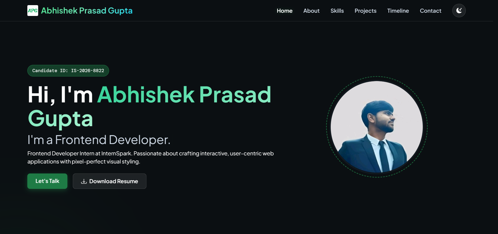
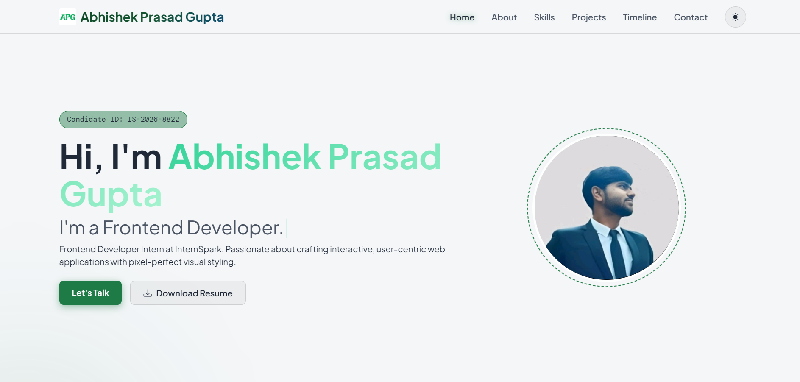
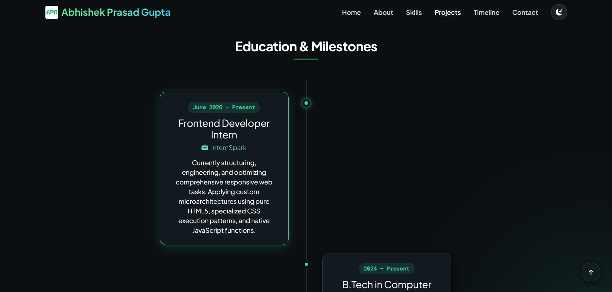

# 🌐 Premium Glassmorphic Portfolio Website

### Built by Abhishek Prasad Gupta | InternSpark Frontend Developer Internship — Task 1


A highly polished, interactive personal portfolio website engineered with a modern **Glassmorphism UI/UX design system**. This portfolio showcases custom JavaScript functionality, dynamic layout components, responsive design principles, and fluid interactive animations built using **pure HTML, CSS, Bootstrap 5, and Vanilla JavaScript**.

---

## 🌐 Live Demo

👉 **[View Live App](https://abhishekprasadgupta21.github.io/InternSpark-Abhishek/task1-portfolio/)**

---

## 📸 Preview

| Dark Theme                           | Light Theme                            |
| ------------------------------------ | -------------------------------------- |
|  |  |

### 📋 Academic & Professional Timeline



---

## ✨ Features

### Visual Architecture & Components

- 💎 **Glassmorphism UI Design** — Implements premium backdrop blur effects (`backdrop-filter`), subtle glass borders, and elegant shadows to create a modern aesthetic.
- 🖊️ **Dynamic Typewriter Effect** — Native JavaScript-powered typing animation that cycles through professional roles with realistic typing and deleting effects.
- 📈 **Scroll Reveal Animations** — Smooth fade and slide animations triggered using the `IntersectionObserver` API as elements enter the viewport.
- ⏱️ **Interactive Timeline Section** — Center-aligned educational and internship timeline with glassmorphic cards and hover effects.
- 🌓 **Dark / Light Theme Toggle** — Seamless switching between themes using CSS custom properties for a consistent user experience.

### Interactive Features

- 📬 **Functional Contact Form** — AJAX-powered form submission with loading states and user feedback.
- 🔗 **Social Media Integration** — Quick access to LinkedIn, GitHub, email, and other professional profiles.
- 🔝 **Back-to-Top Button** — Smooth scrolling button that appears dynamically based on user scroll position.
- 📱 **Fully Responsive Design** — Optimized for mobile devices, tablets, laptops, and desktops.
- 🧮 **Project Showcase Integration** — Features the Task 2 Smart Calculator application as part of the portfolio projects section.

---

## 🗂️ Project Structure

```text
task1-portfolio/
│
├── css/
│   └── style.css         ← Core styling, themes, animations, and Glassmorphism effects
│
├── js/
│   └── app.js            ← Typewriter logic, animations, theme toggle, form handling
│
├── images/
│   ├── apg_logo.png      ← Logo asset
│   ├── calculator.jpeg   ← Task 2 project thumbnail
│   ├── profile.jpeg      ← Profile image asset
│   ├── dark-theme.png    ← Dark theme preview
│   ├── light-theme.png   ← Light theme preview
│   ├── timeline.png      ← Timeline preview image
│   ├── netflix-clone.jpeg ← Task 4 project thumbnail
│   └── todo-app.jpeg     ← Task 3 project thumbnail
│
├── Abhishek_Resume.pdf   ← Downloadable resume
├── index.html            ← Main website structure
└── README.md             ← You are here
```

---

## 🚀 How to Run Locally

### Option 1 — Using VS Code + Live Server (Recommended)

1. Open VS Code
2. `File > Open Folder` → Select the `task1-portfolio` folder
3. Install the **Live Server** extension (by Ritwick Dey)
4. Right-click `index.html` → **Open with Live Server**
5. Opens automatically at `http://127.0.0.1:5500` ✅

### Option 2 — Open Directly in Browser

1. Download or clone this repository
2. Double-click `index.html`
3. Opens directly in your browser ✅

> **Note:** Some interactive features perform best when served using a local server environment.

### Option 3 — Clone via Git

```bash
git clone https://github.com/AbhishekPrasadGupta21/InternSpark-Abhishek.git
# Open task1-portfolio/index.html in your browser
```

---

## ⌨️ Website Sections

| Section     | Purpose                                              |
| ----------- | ---------------------------------------------------- |
| `#home`     | Hero section with introduction and typewriter effect |
| `#about`    | Professional summary and background information      |
| `#skills`   | Technical skills displayed using interactive badges  |
| `#projects` | Portfolio projects with live demo links              |
| `#timeline` | Educational and internship journey timeline          |
| `#contact`  | Contact form and communication links                 |

---

## 🧠 How It Works

### Typewriter Effect

The landing section features a JavaScript-powered typewriter engine that continuously cycles through professional roles by typing and deleting text dynamically.

### Scroll Reveal Animations

Using the `IntersectionObserver` API, elements animate into view as users scroll through the page, improving visual engagement and user experience.

### Sticky Navigation Offset

To prevent the fixed navigation bar from covering section headings during anchor navigation, CSS offset spacing is applied:

```css
#home,
#about,
#skills,
#projects,
#timeline,
#contact {
  scroll-margin-top: 90px;
}
```

### Theme Switching System

CSS Custom Properties (`--variables`) manage all theme colors. Toggling the theme dynamically updates these variables to switch between dark and light modes.

### Timeline Hover Effects

Timeline cards feature smooth hover transitions with glowing effects:

```css
box-shadow:
  0 8px 24px rgba(52, 211, 153, 0.15),
  0 0 12px rgba(52, 211, 153, 0.1);

transform: translateY(-4px);
```

---

## 🛠️ Technologies Used

| Technology                    | Purpose                                        |
| ----------------------------- | ---------------------------------------------- |
| **HTML5**                     | Semantic structure and content organization    |
| **CSS3**                      | Styling, animations, Glassmorphism effects     |
| **Bootstrap 5**               | Responsive layouts and utility classes         |
| **Vanilla JavaScript**        | Interactive functionality and DOM manipulation |
| **CSS Custom Properties**     | Theme management system                        |
| **Intersection Observer API** | Scroll-triggered animations                    |
| **Fetch API / AJAX**          | Contact form submission                        |
| **Bootstrap Icons**           | Visual iconography                             |
| **Google Fonts**              | DM Sans typography                             |

---

## 💡 Key JavaScript Functions

| Function                 | What it does                            |
| ------------------------ | --------------------------------------- |
| `initTypewriter()`       | Controls typing and deleting animations |
| `initScrollAnimations()` | Triggers reveal animations on scroll    |
| `toggleTheme()`          | Switches between dark and light themes  |
| `initBackToTop()`        | Handles back-to-top button visibility   |
| `initContactForm()`      | Processes contact form submissions      |
| `scrollToSection()`      | Smoothly navigates between sections     |

---

## 🎯 What I Learned

- Building premium **Glassmorphism interfaces** using CSS backdrop filters
- Creating responsive layouts with **Bootstrap 5**
- Developing custom **typewriter animations** using Vanilla JavaScript
- Implementing **Intersection Observer API** for performance-friendly animations
- Managing application themes using **CSS Custom Properties**
- Handling asynchronous form submissions using **Fetch API**
- Structuring scalable frontend projects with clean separation of concerns
- Deploying static websites using **GitHub Pages**
- Using **Git & GitHub** for version control and project management

---

## 📋 InternSpark Task Details

- **Internship:** InternSpark Frontend Developer Intern
- **Candidate ID:** IS-2026-8822
- **Task:** Task 1 — Personal Portfolio Website
- **Duration:** 2 Months (Starting 07/06/2026)

---

## 🙏 Acknowledgements

- **InternSpark** — For providing the internship opportunity and project requirements
- **Bootstrap Team** — For responsive design utilities and components
- **Google Fonts** — For the DM Sans typography
- **Shields.io** — For README badges and visual enhancements

---

_Made with ❤️ by Abhishek Prasad Gupta_
