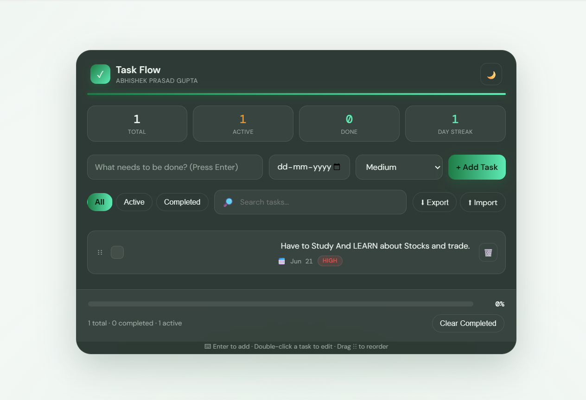
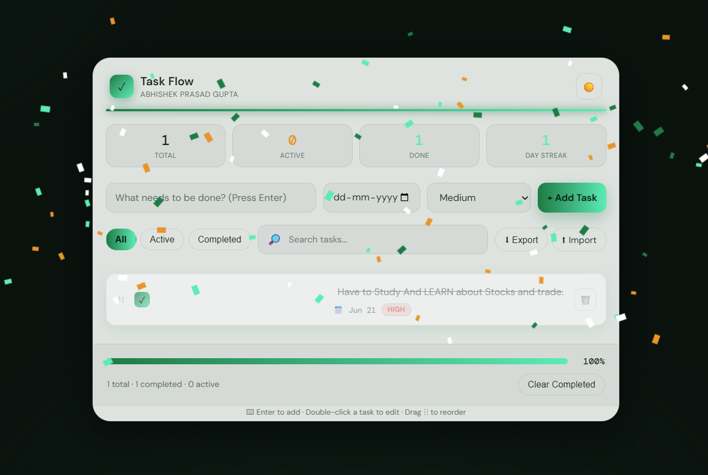

# ✅ Task Flow — Glassmorphic To-Do List App

### Built by Abhishek Prasad Gupta | InternSpark Frontend Developer Internship — Task 3


A feature-rich, glassmorphic to-do list application with drag-and-drop reordering, streak tracking, undo-delete, and a celebratory confetti animation — built entirely with **vanilla HTML, CSS, and JavaScript**.

---

## 🌐 Live Demo

👉 **[View Live App](https://abhishekprasadgupta21.github.io/InternSpark-Abhishek/task3-todo-app/)**

---

## 📸 Preview

| Dark Mode                           | Light Mode                            |
| ----------------------------------- | ------------------------------------- |
|  |  |

---

## ✨ Features

### Core Functionality

- ➕ **Add, Edit, Delete Tasks** — Double-click any task to edit it inline
- ✅ **Mark Complete** — Animated checkbox with strike-through styling
- 📅 **Due Dates** — Set deadlines with automatic overdue warnings (⚠)
- 🎯 **Priority Levels** — Low / Medium / High with color-coded badges
- 🔍 **Search & Filter** — Instantly filter by All / Active / Completed, or search by keyword
- 🖱️ **Drag & Drop Reordering** — Reorder tasks with visual drop-target highlighting
- 💾 **Persistent Storage** — Tasks automatically saved to `localStorage`
- 📤 **Export / Import** — Backup or restore your task list as a JSON file

### Standout USPs

- 🔥 **Day Streak Tracker** — Counts consecutive days you've completed at least one task, persists across sessions
- 📊 **Live Stat Dashboard** — Total / Active / Done / Streak shown as animated counters at the top
- 🎉 **Confetti Celebration** — Canvas-based confetti burst fires automatically when every task is completed
- ↩️ **Undo Delete** — Deleted a task by mistake? A toast notification with an Undo button appears for 5 seconds
- 🌗 **Inverted Theme Toggle** — Switching themes only changes the app card (dark-glass ↔ light-glass); the background page color stays constant, consistent with the Calculator app's design language
- ⌨️ **Keyboard Shortcuts** — Press `/` to jump to search, `n` to focus the add-task input
- 🎬 **Smooth Animations** — Tasks slide in on add and fade out on delete instead of popping instantly

---

## 🗂️ Project Structure

```
task3-todo-app/
│
├── index.html        ← Everything: HTML + CSS + JavaScript in one file
└── README.md         ← You are here
```

> Like the Calculator app, this project is a single self-contained file — no external dependencies, no build step required.

---

## 🚀 How to Run Locally

### Option 1 — Open directly in browser

1. Download or clone this repository
2. Double-click `index.html`
3. Opens directly in your browser ✅

### Option 2 — VS Code + Live Server

1. Open VS Code → `File > Open Folder` → select `task3-todo-app`
2. Install the **Live Server** extension (by Ritwick Dey)
3. Right-click `index.html` → **Open with Live Server**

### Option 3 — Clone via Git

```bash
git clone https://github.com/AbhishekPrasadGupta21/InternSpark-Abhishek.git
# Open task3-todo-app/index.html in your browser
```

---

## ⌨️ Keyboard Shortcuts

| Key                      | Action                           |
| ------------------------ | -------------------------------- |
| `Enter`                  | Add task (when focused on input) |
| `/`                      | Jump to search box               |
| `n`                      | Jump to add-task input           |
| Double-click task        | Edit task text inline            |
| `Enter` (while editing)  | Save edit                        |
| `Escape` (while editing) | Cancel edit                      |

---

## 🧠 How It Works

### Streak Tracking

Each time a task is marked complete, the app checks `localStorage` for the last date a task was completed. If it was yesterday, the streak increments; if it was today already, it stays the same; otherwise it resets to 1.

### Confetti Celebration

When all tasks in the list are marked complete, a lightweight canvas-based particle animation fires — no external libraries, just `requestAnimationFrame` and basic physics (gravity + rotation).

### Undo Delete

Deleting a task doesn't remove it immediately from memory — it's held temporarily while a toast notification displays. Clicking "Undo" within 5 seconds re-inserts it at its original position.

### Theme System

Page background colors (`--page-bg1/2/3`) are defined once in `:root` and never change. Only the glass card's appearance variables (`--glass`, `--text`, `--border`, etc.) are redefined under `[data-theme="dark"]` and `[data-theme="light"]` — so toggling the theme only affects the app card, not the surrounding page.

### Drag & Drop Reordering

Uses the native HTML5 Drag and Drop API (`dragstart`, `dragover`, `drop`) to reassign each task's `order` property, then re-sorts and re-renders the list.

---

## 🛠️ Technologies Used

| Technology                  | Purpose                                            |
| --------------------------- | -------------------------------------------------- |
| **HTML5**                   | Structure and semantic markup                      |
| **CSS3**                    | Glassmorphism styling, animations, responsive grid |
| **Vanilla JavaScript**      | All task logic, DOM manipulation, drag & drop      |
| **CSS Custom Properties**   | Theme management system                            |
| **LocalStorage API**        | Persistent task and streak data                    |
| **HTML5 Drag and Drop API** | Task reordering                                    |
| **Canvas API**              | Confetti celebration animation                     |
| **Google Fonts**            | DM Sans + DM Mono typography                       |

---

## 💡 Key JavaScript Functions

| Function                            | What it does                                       |
| ----------------------------------- | -------------------------------------------------- |
| `addTask()`                         | Creates and saves a new task                       |
| `buildTask(task)`                   | Renders a single task row with all event listeners |
| `deleteTask(id)`                    | Removes a task with animation + undo toast         |
| `reorder(fromId, toId)`             | Handles drag-and-drop reordering logic             |
| `handleTaskCompleted()`             | Updates streak counter and checks for all-done     |
| `checkAllDone()` / `fireConfetti()` | Triggers the celebration animation                 |
| `render()`                          | Re-renders the task list, stats, and progress bar  |
| `save()` / `load()`                 | Persists and restores tasks from localStorage      |

---

## 🎯 What I Learned

- Building a fully-featured CRUD app with **vanilla JavaScript** (no frameworks)
- Implementing the **HTML5 Drag and Drop API** for reordering
- Using the **Canvas API** to build a lightweight particle animation
- Designing a **theme system** where only part of the UI inverts, not the whole page
- Managing **localStorage** for multiple types of persistent state (tasks, theme, streaks)
- Building **undo functionality** with timed toast notifications
- Structuring JSON **export/import** for data portability

---

## 📋 InternSpark Task Details

- **Internship:** InternSpark Frontend Developer Intern
- **Candidate ID:** IS-2026-8822
- **Task:** Task 3 — To-Do List Application
- **Duration:** 2 Months (Starting 07/06/2026)

---

## 🙏 Acknowledgements

- **InternSpark** — For providing the internship opportunity and project requirements
- **Google Fonts** — For DM Sans & DM Mono typography
- **Shields.io** — For README badges

---

_Made with ❤️ by Abhishek Prasad Gupta_
