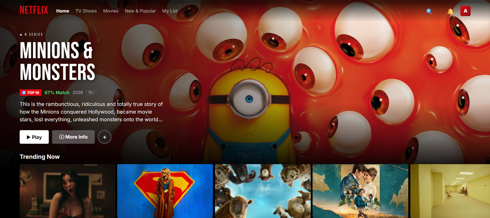
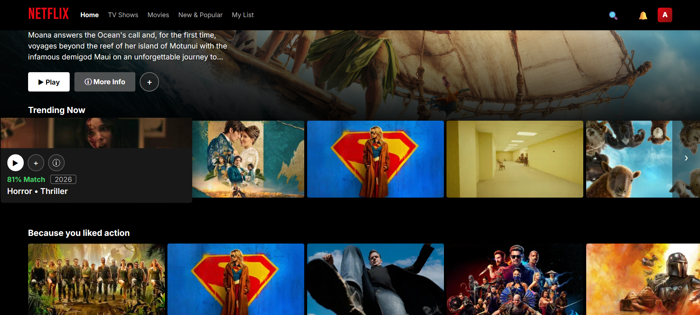
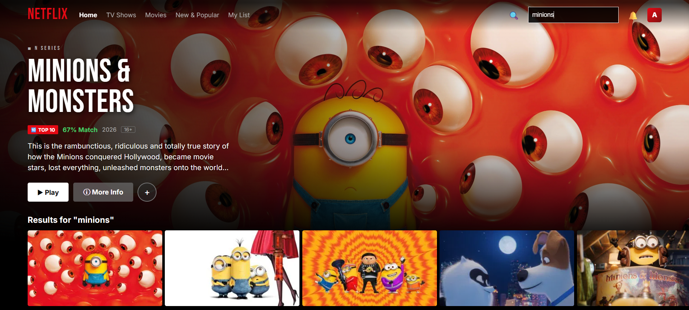
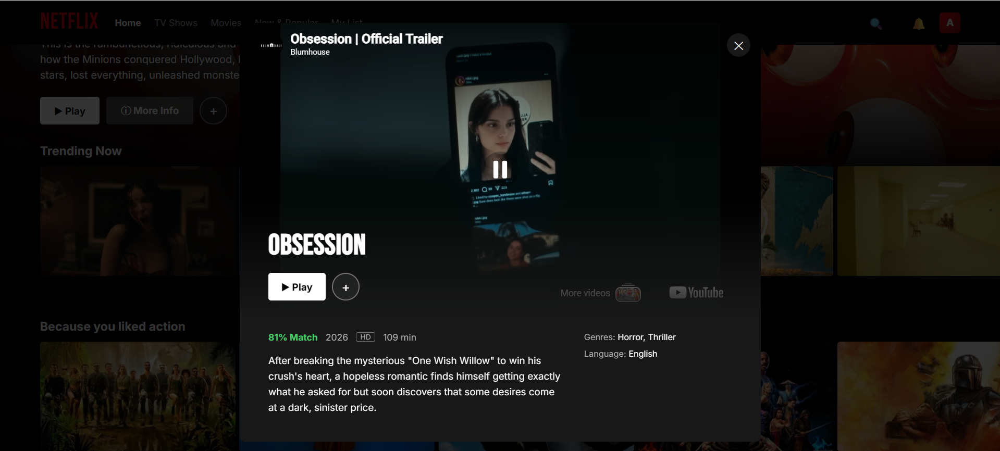

# 🎬 Netflix Clone

### Built by Abhishek Prasad Gupta | InternSpark Frontend Developer Internship — Task 4


A fully functional, pixel-close Netflix UI clone powered by **live movie data from the TMDB API**, complete with a watchlist, simulated continue-watching, and skeleton loading states — built entirely with **vanilla HTML, CSS, and JavaScript**.

---

## 🌐 Live Demo

👉 **[View Live App](https://abhishekprasadgupta21.github.io/InternSpark-Abhishek/task4-netflix-clone/)**

---

## 📸 Preview

| Home — Hero & Rows                 | Hover Preview                        |
| ---------------------------------- | ------------------------------------ |
|  |  |

| Live Search                          | Trailer Modal                              |
| ------------------------------------ | ------------------------------------------ |
|  |  |

---

## ✨ Features

### Core Functionality

- 🎥 **Live TMDB Integration** — real posters, ratings, overviews, and release years pulled from a real movie database
- 🖱️ **Hover-to-Preview Cards** — posters scale up on hover and reveal play/add/info icons, match %, and genre tags, matching real Netflix's card behavior
- 🔍 **Live Search** — debounced search across TMDB's movie catalog, expandable search bar in the navbar
- ▶️ **Trailer Modal** — clicking any title opens a modal with an embedded YouTube trailer (falls back to a backdrop image if no trailer exists)
- 🎞️ **Genre-Based Rows** — Trending, Top Rated, Action, Comedy, Horror, Romance, Documentaries, Family, with hover-reveal scroll arrows

### Standout USPs

- ❤️ **My List (Watchlist)** — add any title to your list; persists via `localStorage` and has its own dedicated nav tab
- 📊 **Simulated Continue Watching** — opening a title stores a random progress percentage, rendered as a red progress bar on the card (mimics Netflix's resume-playback UX)
- 💀 **Skeleton Loading Shimmer** — animated placeholder cards while each row fetches data, instead of a blank screen
- 🍿 **Dynamic Hero Banner** — random trending pick on every load, with live like/info/play actions and a "Top 10" badge
- 📱 **Fully Responsive** — adapts layout, nav, and card sizing across phone, tablet, and desktop breakpoints
- 🍔 **Mobile Nav Panel** — collapses into a hamburger menu with a slide-down panel on small screens

---

## 🗂️ Project Structure

```
task4-netflix-clone/
│
├── images/
│   ├── home-hero.png       ← Hero + rows preview
│   ├── row-hover.png       ← Hover state preview
│   ├── search.png          ← Search results preview
│   └── modal-trailer.png   ← Trailer modal preview
│
├── index.html        ← Everything: HTML + CSS + JavaScript in one file
└── README.md          ← You are here
```

> Like the To-Do app and Calculator, this project is a single self-contained file — no external dependencies besides the TMDB API and Google Fonts.

---

## 🔑 Setup — TMDB API Key Required

This app fetches real movie data, so it needs a free TMDB API key to run:

1. Create a free account at [themoviedb.org](https://www.themoviedb.org/)
2. Go to **Settings → API** and request a free Developer key
3. Open `index.html`, find:
   ```js
   const API_KEY = "PASTE_YOUR_TMDB_API_KEY_HERE";
   ```
4. Replace it with your key and save

Without a key, the app shows a friendly on-screen prompt instead of failing silently.

---

## 🚀 How to Run Locally

### Option 1 — Open directly in browser

1. Download or clone this repository
2. Add your TMDB API key (see above)
3. Double-click `index.html` — opens directly in your browser ✅

### Option 2 — VS Code + Live Server

1. Open VS Code → `File > Open Folder` → select `task4-netflix-clone`
2. Install the **Live Server** extension (by Ritwick Dey)
3. Right-click `index.html` → **Open with Live Server**

### Option 3 — Clone via Git

```bash
git clone https://github.com/AbhishekPrasadGupta21/InternSpark-Abhishek.git
# Open task4-netflix-clone/index.html in your browser
```

---

## 🧠 How It Works

### Data Fetching

All movie data comes from TMDB's REST API (`/trending`, `/discover`, `/search`, `/movie/{id}`, `/movie/{id}/videos`). Each row fetches independently and renders a shimmer skeleton until data resolves.

### Watchlist Persistence

Liked titles are stored as an array of lightweight movie objects in `localStorage` under `nf_watchlist`, so the list survives page refreshes.

### Continue Watching Simulation

Since there's no real video playback, opening a title's modal or hitting its play icon stores a randomized progress percentage per movie ID in `localStorage` (`nf_continue`), which renders as a red bar at the bottom of that card on future visits — mirroring Netflix's resume feature purely on the frontend.

### Trailer Modal

On open, the app fetches `/movie/{id}/videos` and looks for a YouTube trailer; if found, it's embedded directly with autoplay muted. If no trailer exists, the movie's backdrop image is shown instead.

### Responsive Layout

Card widths, hero sizing, and the navbar all use fluid, percentage/`clamp()`-based sizing rather than fixed breakpoint values where possible, with dedicated adjustments under 768px (phone) and 1000–1100px (tablet) for nav collapse, card counts per row, and modal layout.

---

## 🛠️ Technologies Used

| Technology             | Purpose                                                  |
| ---------------------- | -------------------------------------------------------- |
| **HTML5**              | Structure and layout                                     |
| **CSS3**               | Netflix-style theming, hover animations, responsive grid |
| **Vanilla JavaScript** | API calls, DOM rendering, state management               |
| **TMDB API**           | Live movie data, posters, trailers, search               |
| **LocalStorage API**   | Watchlist + continue-watching persistence                |
| **Fetch API**          | Async data loading                                       |
| **Google Fonts**       | Bebas Neue + Inter typography                            |

---

## 💡 Key JavaScript Functions

| Function                | What it does                                                   |
| ----------------------- | -------------------------------------------------------------- |
| `tmdbFetch(path)`       | Wraps the TMDB fetch call with the API key + language          |
| `setupHero()`           | Picks a random trending title and populates the hero banner    |
| `buildRow(cat)`         | Fetches a category and renders its skeleton → real card row    |
| `buildCard(item)`       | Renders a single title card with hover overlay + actions       |
| `openModal(id)`         | Fetches movie details + videos and populates the trailer modal |
| `toggleWatchlist(item)` | Adds/removes a title from `localStorage` My List               |
| `runSearch(query)`      | Debounced search against TMDB and re-renders the row           |
| `renderDefaultRows()`   | Clears and rebuilds all category rows                          |

---

## 🎯 What I Learned

- Consuming and structuring data from a **real-world REST API**
- Building **debounced search** for responsive UX without spamming API calls
- Simulating stateful features (watchlist, continue watching) purely on the frontend with `localStorage`
- Designing **hover-driven micro-interactions** to match a polished production UI
- Handling **async loading states** gracefully with skeleton shimmer UI
- Embedding third-party media (YouTube trailers) dynamically based on API responses
- Writing **fluid, breakpoint-based responsive CSS** for phone/tablet/desktop from a single stylesheet

---

## 📋 InternSpark Task Details

- **Internship:** InternSpark Frontend Developer Intern
- **Candidate ID:** IS-2026-8822
- **Task:** Task 4 — Netflix Clone
- **Duration:** 2 Months (Starting 07/06/2026)

---

## 🙏 Acknowledgements

- **InternSpark** — For providing the internship opportunity and project requirements
- **[TMDB](https://www.themoviedb.org/)** — For the free movie database API (this product uses the TMDB API but is not endorsed or certified by TMDB)
- **Google Fonts** — For Bebas Neue and Inter typography
- **Shields.io** — For README badges

---

_Made with ❤️ by Abhishek Prasad Gupta_
